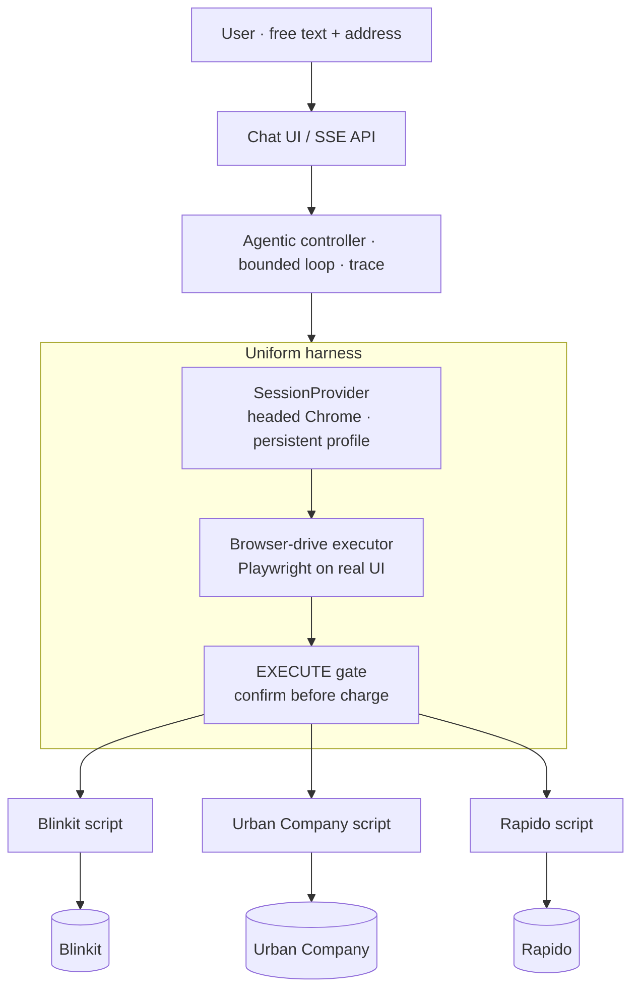
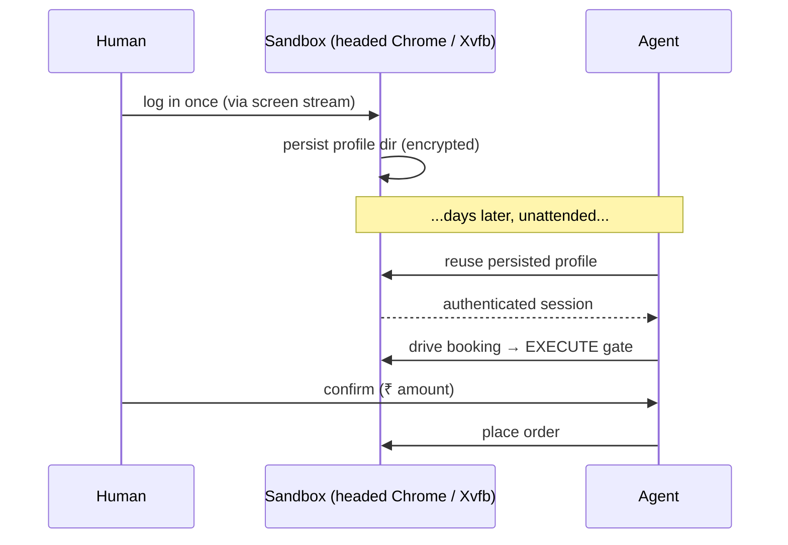

# faff — the uniform harness concept

**One idea:** don't build three apps. Build one harness that reaches any consumer app, plus a thin per-site script. Reverse-engineering a 4th app = write one more script.

---

## The insight

The three targets differ in *what you click*, not in *how you operate them*. So unify the mechanism, not the business logic.

Every target needs: an authenticated session, a way to drive it, a way to stream progress, and a money-boundary. All four are **identical** across Blinkit, Urban Company, and Rapido. Only the navigation steps differ.

| Layer | Shared across all 3? | What it is |
|---|---|---|
| Interpret (text → intent) | ✅ uniform | one LLM call |
| Session / auth | ✅ uniform | headed Chrome + persistent profile |
| Execution surface | ✅ uniform | Playwright drives the real UI |
| Event contract + EXECUTE gate | ✅ uniform | typed SSE events, confirm-before-charge |
| **Navigation script** | ❌ per-site | "search SKU" vs "pick slot" vs "set route" |

The per-site script is irreducible domain logic — but it's now *just a thin UI script* in one framework, behind one interface.

---

## Architecture

Everything above the per-site scripts is written once. A 4th app plugs in as a 4th script + a SessionProvider config.

---

## Session model: headed, unattended, persistent

**Unattended ≠ headless.** Run *real headed Chrome* on a headless VM under a virtual display (Xvfb). Nobody watches the screen, but it renders and fingerprints like a real browser — deleting the headless-detection tell at zero cost.

Log in **once** (human, via the sandbox's screen stream). The full Chrome profile directory persists (cookies + device-trust + storage). Every unattended run after that reuses it. Re-auth becomes a rare exception, not a per-run problem.

The profile directory is a **secret** — it holds live tokens + device-trust. Encrypt at rest, keep out of the repo, and probe validity cheaply so expiry triggers a one-time re-login instead of a mid-run failure.

---

## Two seams for the human, one mechanism

Both human touchpoints use the same suspend/resume + SSE-event machinery:

1. **`login_required`** → human logs in once in the sandbox, agent resumes.
2. **`awaiting_confirmation`** (EXECUTE gate) → human approves the charge, agent places the order.

Payment stays off the agent: prefer cash-on-delivery, the account's saved method, or a UPI-collect prompt the human approves. The agent never touches raw card data.

---

## PoC now, scale later

| | PoC / MVP | At 1M users |
|---|---|---|
| Execution | uniform browser-drive everywhere | promote hot paths to API-replay |
| Why | one mechanism, works on all 3, fastest to demo | browser-per-session is the expensive thing |
| Blinkit | browser-drive | API-replay (tokens extracted from same profile) |
| UC booking | browser-drive | stays browser-drive (hardened write) |
| Cost ceiling | — | LLM spend + third-party rate limits, not servers |

Both executors sit behind the same `Drive` interface and feed off the same persisted profile — so API-replay is a per-target *optimization*, not a rewrite. **Make it work, then make it fast.**

---

## The claim this buys

> A 4th app = one SessionProvider config + one navigation script.

Session, browser, events, gate, and payments are already solved and shared. That is the "reverse-engineering a 4th app is a piece of cake" outcome — by design.
